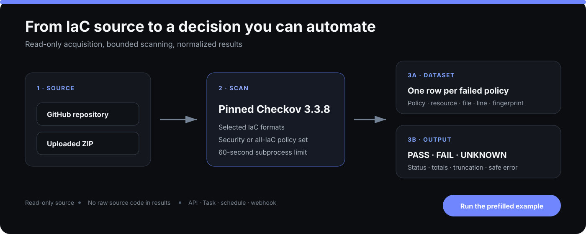
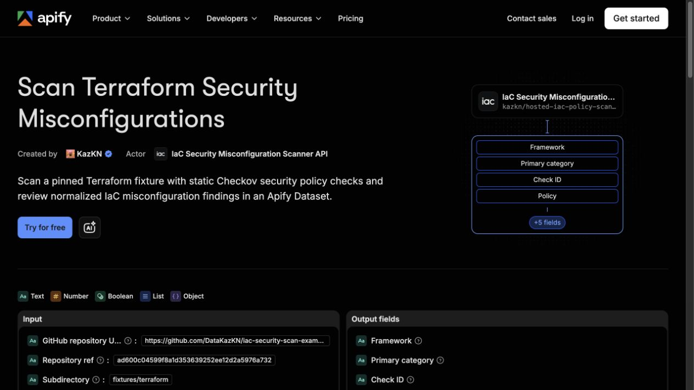
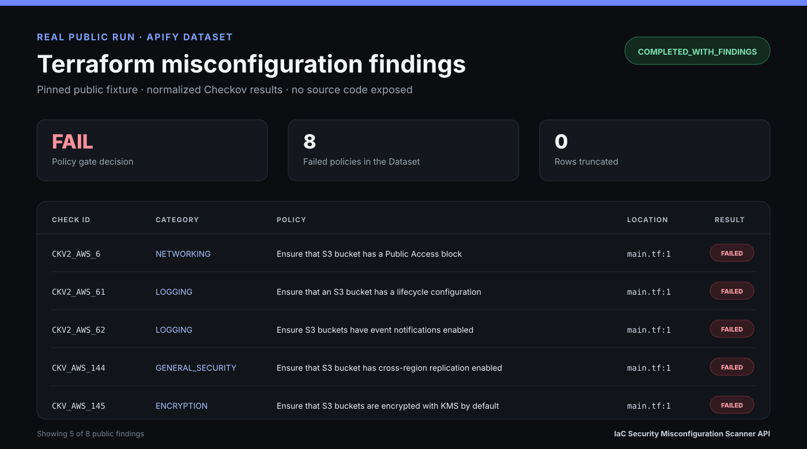

# IaC Security Scan Examples

[](https://apify.com/kazkn/hosted-iac-policy-scan-api)

[](LICENSE)

Copy-paste examples for scanning Infrastructure as Code (IaC) security
misconfigurations with the
[IaC Security Misconfiguration Scanner API](https://apify.com/kazkn/hosted-iac-policy-scan-api).

> **Safety:** every file under `fixtures/` is deliberately insecure. Use these files
> only as scanner test data. **Never deploy them** to a cloud account, cluster, or
> production environment.

## What this repository is for

This repository gives developers, platform engineers, and DevSecOps teams a
reproducible way to:

- test Terraform, Kubernetes, Dockerfile, CloudFormation, Helm, and GitHub Actions
  policy detection;
- run the hosted Actor from Apify Console, shell, Python, or CI;
- understand the Dataset finding rows and the separate `OUTPUT` summary;
- prove that a security gate blocks an intentionally vulnerable snapshot.

The fixtures contain no credentials, private URLs, real account identifiers, or
deployment commands. The repository is public so every example can pin the same
immutable Git commit.

## Features

- Deterministic vulnerable fixtures for the main IaC formats supported by the
  Actor.
- Copy-ready Actor input JSON for a public GitHub repository scan.
- Shell and Python API examples with bounded Apify charge protection.
- GitHub Actions gate example that blocks anything except `gateDecision = PASS`.
- Simplified Dataset and `OUTPUT` examples for parsers, demos, and tests.
- Dependency-free repository tests and Markdown link checks.

## What you can test

| Fixture | Path | Intentional signal |
|---|---|---|
| Terraform | [`fixtures/terraform`](fixtures/terraform) | Public-read S3 bucket |
| Kubernetes | [`fixtures/kubernetes`](fixtures/kubernetes) | Privileged container and floating image tag |
| Dockerfile | [`fixtures/dockerfile`](fixtures/dockerfile) | Root user, broad permissions, floating base image |
| AWS CloudFormation | [`fixtures/cloudformation`](fixtures/cloudformation) | Public-read S3 bucket |
| Helm | [`fixtures/helm`](fixtures/helm) | Privileged container and floating image tag |
| GitHub Actions | [`fixtures/.github/workflows`](fixtures/.github/workflows) | Write-all permissions with untrusted PR content |

The unsafe workflow stays below `fixtures/`, not at the repository root, so GitHub
cannot execute it as a repository workflow.

## Quick start

No local scanner installation is required.

1. Open the [Actor on Apify](https://apify.com/kazkn/hosted-iac-policy-scan-api).
2. Keep **GitHub repository** as the source type.
3. Use:

   ```text
   Repository URL: https://github.com/DataKazKN/iac-security-scan-examples
   Repository ref: ad600c04599f8a1d353639252ee12d2a5976a732
   Subdirectory: fixtures/terraform
   Frameworks: terraform
   Policy profile: security
   Maximum findings: 25
   ```

4. Run the Actor.
5. Expect a successful scan with `status = COMPLETED_WITH_FINDINGS` and
   `gateDecision = FAIL`. `FAIL` is expected because the fixture is deliberately
   vulnerable.

The commit SHA is immutable, so this quick start keeps producing the same source
snapshot even when `main` evolves.

## Visual walkthrough

The Actor keeps acquisition, scanning, and automation output separate. Click the
workflow to open the prefilled input:

[](https://console.apify.com/actors/hrUBKuy93HIu7dBtp/input)

The public Terraform Example exposes its complete credential-free input and
simplified output on Apify:

[](https://apify.com/kazkn/hosted-iac-policy-scan-api/examples/scan-terraform-security-misconfigurations)

The result below is based on the real eight-row public Dataset, not a mock. Click it
to inspect the normalized JSON:

[](https://api.apify.com/v2/datasets/juCpMz5uiUXUi5Ggh/items?clean=true&format=json)

Use the [Actor Store page](https://apify.com/kazkn/hosted-iac-policy-scan-api) for
current pricing, supported frameworks, limits, public Tasks, and the complete input
and output contract.

## Setup requirements

For Console-only testing, you need only an Apify account. For API or CI usage:

- create an Apify API token;
- keep the token in `APIFY_API_TOKEN`;
- install `curl` and `jq` for the shell example;
- use Python 3.10 or newer for the Python example;
- keep `maxTotalChargeUsd` set unless you intentionally approve a higher run cap.

## Repository structure

```text
.
├── fixtures/                  # Inert, deliberately insecure IaC samples
├── examples/
│   ├── api/                   # Shell and Python API clients
│   ├── github-actions/        # Copy-ready CI security gate
│   ├── inputs/                # Valid Actor input JSON
│   └── outputs/               # Simplified OUTPUT and Dataset examples
├── proofs/                    # Sanitized local contract evidence
├── docs/                      # Detailed usage and troubleshooting guides
├── scripts/check_links.py     # Local and HTTP Markdown-link validator
└── tests/                     # Dependency-free repository contract tests
```

See the [complete usage guide](docs/USAGE.md) for private repositories, ZIP uploads,
all supported frameworks, pricing, limits, and output semantics. A
[French owner guide](docs/GUIDE_FR.md) is also available.

## Run through the Apify API

### Shell

Requirements: `bash`, `curl`, `jq`, an Apify account, and an API token.

```bash
export APIFY_API_TOKEN="your_token"
./examples/api/run-scan.sh
```

The script starts the Actor, waits for completion, prints `OUTPUT`, then prints the
first Dataset rows. It does not fail merely because the vulnerable fixture returns
`FAIL`. To use it as a deployment gate:

```bash
./examples/api/run-scan.sh --enforce
```

### Python

The Python example uses only the standard library:

```bash
export APIFY_API_TOKEN="your_token"
python3 examples/api/run-scan.py
python3 examples/api/run-scan.py --enforce
```

Never commit `APIFY_API_TOKEN`. Store it in your CI secret manager or local
environment.

## Add an automated GitHub Actions gate

Copy [`examples/github-actions/iac-security-gate.yml`](examples/github-actions/iac-security-gate.yml)
to `.github/workflows/iac-security-gate.yml` in the repository you want to scan.
Then create an `APIFY_API_TOKEN` repository secret.

The workflow:

- runs only for IaC-related pull-request paths or manual dispatch;
- grants GitHub `contents: read` permission only;
- pins the scan to the current Git commit;
- scans Terraform, CloudFormation, Kubernetes, Helm, Dockerfile, and GitHub Actions;
- accepts only `gateDecision = PASS`;
- blocks `FAIL`, `UNKNOWN`, Actor failure, and unexpected responses.

Forked pull requests do not receive repository secrets by default. Use a trusted
manual workflow or your organization’s reviewed secret policy for that case. Do not
switch this example to `pull_request_target` with untrusted checkout.

## Configuration

| Input | Required | Purpose |
|---|---:|---|
| `sourceType` | Yes | `github` or `zip_upload` |
| `repositoryUrl` | GitHub only | Exact `https://github.com/{owner}/{repo}` URL |
| `repositoryRef` | Recommended | Branch, tag, or preferably a full immutable commit SHA |
| `subdirectory` | No | Restrict the scan to one relative repository path |
| `archiveFile` | ZIP only | Apify Key-Value Store record selected by the Console file picker |
| `githubToken` | Private GitHub only | Fine-grained, read-only Contents token |
| `frameworks` | Yes | One or more supported IaC framework slugs |
| `policyProfile` | Yes | `security` or `all_iac` |
| `checkIds` | No | Up to 100 explicit Checkov policy IDs |
| `maxFindings` | Yes | Retain 1–500 failed policies in the Dataset |

Use [`examples/inputs/public-repository.json`](examples/inputs/public-repository.json)
as the canonical credential-free input. Detailed rules and limits are in
[`docs/USAGE.md`](docs/USAGE.md).

## Output contract

The Actor writes two different outputs:

- the default **Dataset** contains one normalized row per retained failed policy;
- the Key-Value Store **`OUTPUT`** record contains scan status, counters, source
  statistics, truncation state, and the gate decision.

`gateDecision` has exactly three meanings:

| Decision | Meaning | Automation action |
|---|---|---|
| `PASS` | Scan completed and no selected policy failed | Continue |
| `FAIL` | Scan completed and one or more selected policies failed | Block and review findings |
| `UNKNOWN` | The scan could not produce a trustworthy policy result | Block and investigate |

`COMPLETED_WITH_FINDINGS` is a technically successful scan, even though its policy
gate is `FAIL`. The Actor does not invent severity: findings are `UNRATED`.

Review the simplified [`OUTPUT` example](examples/outputs/output.json), the
[`Dataset example`](examples/outputs/dataset-items.json), and the sanitized
[`proofs`](proofs).

## Use cases

- Smoke-test an IaC security scanner before integrating it.
- Give a team deterministic vulnerable inputs for a demo or workshop.
- Scan a public GitHub snapshot without maintaining Checkov infrastructure.
- Add a hosted misconfiguration gate to a CI workflow.
- Validate API parsing against stable Dataset and `OUTPUT` shapes.
- Reproduce a reported scanner result from a full Git commit SHA.

This Actor scans static IaC misconfigurations. It is not a secrets scanner,
dependency scanner, container-image scanner, live-cloud CSPM, exploitability
assessment, or substitute for human review.

## FAQ and troubleshooting

### Does the Actor fix the misconfigurations?

No. It returns normalized policy findings and a gate decision. It does not modify
source code, open pull requests, or deploy infrastructure.

### Can it scan a private repository?

Yes. Supply a fine-grained GitHub token with read-only Contents access to only the
target repository. Never embed the token in the repository URL or commit it.

### Is `FAIL` an Actor crash?

No. `FAIL` means the scan completed and found selected policy failures. A technical
failure produces `UNKNOWN` and may also make the Actor run fail.

### Does it replace Checkov in CI?

No. Use this hosted Actor when you need a bounded API batch scan. Keep a native CI
scanner when you need organization-specific policy configuration, suppressions,
baselines, or immediate local feedback.

Common cases:

- **`FAIL` on the quick start:** expected; the fixture is intentionally vulnerable.
- **`UNKNOWN`:** treat it as a technical failure and inspect `OUTPUT.error`.
- **Actor run is not `SUCCEEDED`:** inspect the Apify run log and `OUTPUT` before
  retrying.
- **GitHub `404`:** verify the exact URL/ref and add a least-privilege token only for
  a private repository.
- **CI secret missing:** create `APIFY_API_TOKEN`; do not paste it into workflow YAML.
- **Charge limit rejected:** keep the example’s `$0.51` run cap or deliberately set a
  higher approved cap.

See the [troubleshooting guide](docs/TROUBLESHOOTING.md) for corrective steps and
the Actor’s [public documentation](https://apify.com/kazkn/hosted-iac-policy-scan-api)
for current runtime limits.

## Contributing

Read [`CONTRIBUTING.md`](CONTRIBUTING.md) before adding a fixture. Contributions
must remain deterministic, credential-free, non-deployable by default, and covered
by the repository contract tests.

Security-sensitive reports belong in [`SECURITY.md`](SECURITY.md), not in a public
issue containing a secret.

## License

Repository-authored documentation, scripts, and fixtures are available under the
[MIT License](LICENSE). Checkov is a separate Apache-2.0 project; see
[`legal/THIRD_PARTY_NOTICES.md`](legal/THIRD_PARTY_NOTICES.md).

## Run the Actor

Scan your own Terraform, Kubernetes, Dockerfile, CloudFormation, Helm, or other
supported IaC source:

**[Run IaC Security Misconfiguration Scanner API on Apify →](https://apify.com/kazkn/hosted-iac-policy-scan-api)**
